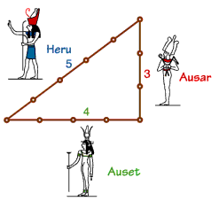

# 직각삼각형
# 문제
> 과거 이집트인들은 각 변들의 길이가 3, 4, 5인 삼각형이 직각 삼각형인것을 알아냈다. 주어진 세변의 길이로 삼각형이 직각인지 아닌지 구분하시오.
> 
> 

# 입력
입력은 여러개의 테스트케이스로 주어지며 마지막줄에는 0 0 0이 입력된다. 각 테스트케이스는 모두 30,000보다 작은 양의 정수로 주어지며, 각 입력은 변의 길이를 의미한다.

# 출력
각 입력에 대해 직각 삼각형이 맞다면 "right", 아니라면 "wrong"을 출력한다.

# 예제 입력 1
```
6 8 10
25 52 60
5 12 13
0 0 0
```
# 예제 출력 1
```
right
wrong
right
```

# 해결방안
- 마지막줄에 0 0 0 이 입력되면 끝
- 각 테스트 케이스는 30000보다 작은 양의 정수이기 때문에 Long을 받는다.
- 세 변이 직각 삼각형을 이루는 지는 피타고라스의 정의를 이용하면 된다.
- 피타고라스 정의는 가장 긴 변이 C라고 두었을때 $ C^2 = A^2 + B^2 $ 로 계산하다.
- 이게 맞을 때는 right 출력, 틀릴경우에는 wrong을 출력