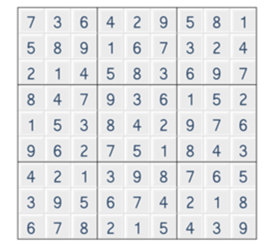
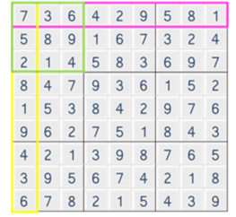

# 1974. 스도쿠 검증
## 문제
> 스도쿠는 숫자퍼즐로, 가로 9칸 세로 9칸으로 이루어져 있는 표에 1 부터 9 까지의 숫자를 채워넣는 퍼즐이다.
> 
> 
> 
> 같은 줄에 1 에서 9 까지의 숫자를 한번씩만 넣고, 3 x 3 크기의 작은 격자 또한, 1 에서 9 까지의 숫자가 겹치지 않아야 한다.
> 
> 
> 
> 입력으로 9 X 9 크기의 스도쿠 퍼즐의 숫자들이 주어졌을 때, 위와 같이 겹치는 숫자가 없을 경우, 1을 정답으로 출력하고 그렇지 않을 경우 0 을 출력한다.
>
## 입력
입력은 첫 줄에 총 테스트 케이스의 개수 T가 온다.

다음 줄부터 각 테스트 케이스가 주어진다.

테스트 케이스는 9 x 9 크기의 퍼즐의 데이터이다.

## 출력
테스트 케이스 t에 대한 결과는 “#t”을 찍고, 한 칸 띄고, 정답을 출력한다.

(t는 테스트 케이스의 번호를 의미하며 1부터 시작한다.)
## 제한
1. 퍼즐은 모두 숫자로 채워진 상태로 주어진다.

2. 입력으로 주어지는 퍼즐의 모든 숫자는 1 이상 9 이하의 정수이다.
## 예제입력 1
```
10
7 3 6 4 2 9 5 8 1
5 8 9 1 6 7 3 2 4
2 1 4 5 8 3 6 9 7
8 4 7 9 3 6 1 5 2
1 5 3 8 4 2 9 7 6
9 6 2 7 5 1 8 4 3
4 2 1 3 9 8 7 6 5
3 9 5 6 7 4 2 1 8
6 7 8 2 1 5 4 3 9
7 3 6 4 8 9 2 5 1
8 5 2 7 3 1 6 9 4
9 1 4 5 6 2 7 3 8
4 9 7 2 5 6 8 1 3
5 6 3 1 8 7 9 4 2
2 8 1 9 4 3 5 6 7
6 7 5 3 2 4 1 8 9
1 4 9 6 7 8 3 2 5
3 2 8 1 9 5 4 7 6
2 4 6 7 5 3 1 9 8
7 5 8 1 9 4 2 3 6
3 9 1 2 6 8 7 5 4
5 8 2 3 4 6 9 7 1
1 6 3 9 7 2 4 8 5
9 7 4 8 1 5 6 2 3
4 2 7 5 8 1 3 6 9
6 3 5 4 2 9 8 1 7
8 1 9 6 3 7 5 4 2
8 4 5 2 9 6 1 3 7
1 3 6 7 5 8 4 9 2
9 7 2 1 3 4 6 5 8
2 9 7 4 6 3 8 5 1
4 6 1 5 8 2 9 7 3
5 8 3 9 7 1 2 4 6
3 2 8 6 4 5 7 1 9
7 1 4 3 2 9 6 8 5
6 5 9 8 1 7 3 2 4
4 5 7 1 6 3 8 2 9
6 3 9 8 2 7 5 4 1
7 9 3 4 8 5 1 6 2
1 8 2 5 4 9 6 3 7
8 6 1 7 9 2 3 5 4
5 2 4 6 3 1 7 9 8
3 7 6 9 1 4 2 8 5
2 4 5 3 7 8 9 1 6
9 1 8 2 5 6 4 7 3
1 5 2 3 8 6 9 4 7
4 8 3 2 7 9 1 5 6
7 6 9 1 5 4 8 2 3
2 1 8 6 4 7 5 3 9
6 9 7 5 3 8 2 1 4
5 3 4 9 1 2 6 7 8
9 7 1 4 6 5 3 8 2
8 2 5 7 9 3 4 6 1
3 4 6 8 2 1 7 9 5
1 5 8 6 7 2 3 4 9
7 2 9 3 4 8 5 1 6
6 3 4 5 1 9 7 2 8
8 9 2 1 2 5 6 7 4
3 7 6 8 9 4 2 5 1
5 4 1 7 3 6 8 9 3
2 8 7 9 6 1 4 3 5
4 1 5 2 8 3 9 6 7
9 6 3 4 5 7 1 8 2
1 2 4 9 3 6 7 8 5
7 8 6 2 4 5 3 9 1
3 9 5 1 7 8 2 4 6
5 1 9 4 6 2 8 7 3
4 6 7 8 9 3 5 1 2
8 3 2 5 1 7 9 6 4
9 7 3 6 5 4 1 2 8
6 5 8 7 2 1 4 3 9
2 4 1 3 8 9 6 5 7
5 9 3 8 4 1 7 6 2
2 1 8 7 6 3 4 9 5
7 6 4 9 2 5 1 3 8
4 3 6 5 9 2 8 1 7
1 8 5 4 3 7 9 2 6
9 2 7 1 8 6 5 4 3
3 4 1 6 5 8 2 7 9
6 5 9 2 7 4 3 8 1
8 7 2 3 1 9 6 5 4
7 1 4 5 8 9 2 3 6
8 5 2 3 6 4 7 1 9
3 6 9 1 7 2 8 5 4
2 3 1 9 4 6 5 7 8
6 8 5 7 3 2 9 4 1
9 4 7 8 1 5 3 6 2
1 7 8 6 9 3 4 2 5
4 2 3 1 5 8 6 9 7
5 9 6 4 2 7 1 8 3
```
## 예제 출력 1
```
#1 1
#2 0
#3 1
#4 0
#5 0
#6 1
#7 0
#8 1
#9 1
#10 0
```