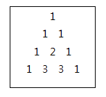

# 2005. 파스칼의 삼각형
## 문제
> 크기가 N인 파스칼의 삼각형을 만들어야 한다.
> 
> 파스칼의 삼각형이란 아래와 같은 규칙을 따른다.
> 
> 1. 첫 번째 줄은 항상 숫자 1이다.
>
> 2. 두 번째 줄부터 각 숫자들은 자신의 왼쪽과 오른쪽 위의 숫자의 합으로 구성된다.
> 
> N이 4일 경우,
> 
>
> 
> N을 입력 받아 크기가 N인 파스칼의 삼각형을 출력하는 프로그램을 작성하시오.
>
## 입력
가장 첫 줄에는 테스트 케이스의 개수 T가 주어지고, 그 아래로 각 테스트 케이스가 주어진다.
각 테스트 케이스에는 N이 주어진다.
## 출력
각 줄은 '#t'로 시작하고, 다음 줄부터 파스칼의 삼각형을 출력한다.

삼각형 각 줄의 처음 숫자가 나오기 전까지의 빈 칸은 생략하고 숫자들 사이에는 한 칸의 빈칸을 출력한다.

(t는 테스트 케이스의 번호를 의미하며 1부터 시작한다.)

## 제한
파스칼의 삼각형의 크기 N은 1이상 10이하의 정수이다.
## 예제입력 1
```
1 
4
```
## 예제 출력 1
```
#1
1
1 1
1 2 1
1 3 3 1
```