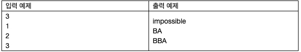

# 22039. 피보나치 수 분배
## 문제
> 피보나치 수열은 $f_1 = 1, f_2 = 1, f_i = f_{i-1} + f_{i-2}(i \leq 3)$으로 정의 되는 수열이다.
> 
> 예로 $f_3 = 2, f_4 = 3, f_5 = 5, f_6 = 8, f_7 = 13,\dots$이다.
> 
> 1,2,...N을 두 개의 집합 A,B로 분할해서, $\sum_{a\in A}f_a = \sum_{b\in B}f_b$를 만족시키는 게 가능한지 확인하고, 가능하다면 분할 방법을 출력하는 프로그램을 작성하라.
> 
## 입력
첫 번째 줄에 테스트 케이스의 수 T가 주어진다.

각 테스트 케이스는 하나의 줄로 이루어지며, 정수 N (1<=N<=100) 가 주어진다.
## 출력
각 테스트 케이스마다,

-   만약 피보나치 수들의 합이 같도록 분할하는 것이 불가능하다면, “impossible”을 출력한다.

-   분할이 가능하다면, 길이가 N인 문자열을 출력한다. 이 중 i번째 글자는 i∈A이면 ‘A’, i∈B이면 ‘B’여야 한다.



## 예제입력 1
```
3
1
2
3
```
## 예제 출력 1
```
impossible
BA
BBA
```