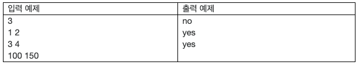

# 22759. 묶음 판매
## 문제
> 편의점을 운영하는 점장인 당신은 음료수를 묶음 판매하고자 한다. 묶음판매란 X개의 음료수를 묶어서 한 세트로 판매하는 것이다. 고객이 음료수를 사고 싶다면 X개짜리 세트를 사거나, 1개짜리 단제품을 구매할 수 있게 된다. 당신은 이제 이 X의 값을 정하고자 한다.
>
>적절한 X 값을 정해보기 위해 당신은 고객의 입장에서 생각을 해 보기로 하였다. 고객이 편의점에 들어와서 음료수 N개를 사고 싶다고 해 보자. 당연히 묶음 판매되는 것을 많이 살수록 이득일 것이므로, 고객은 ⌊N/X⌋(N을 X로 나눈 몫)개의 묶음 세트를 사고, N mod X (N을 X로 나눈 나머지)개의 단제품을 구매할 것이다.
>
>그런데 구매할 단제품의 개수가 너무 많으면 일일이 담기 번거로우므로, 차라리 묶음 제품을 하나 더 구매하는 것이 나을 수도 있을 것이다. 당신은 N mod X가 X/2 이상이면 고객이 단제품 N mod X개 대신 음료수 X개짜리 묶음 세트를 하나 더 구매할 것이라고 생각한다.
>
>당신은 고객 분석을 통해, 모든 고객은 항상 편의점에 들어가는 순간 L개 이상 R개 이하의 음료수를 구매하고 싶다는 것을 알게 되었다. 당신은 X의 값을 잘 정하여, 모든 경우(즉 N이 L 이상 R 이하인 모든 R-L+1가지의 경우)에 대해 고객이 단제품 대신 묶음 세트를 하나 더 구매하는 자연수 X가 존재하는지를 판단하려고 한다.


## 입력
첫 번째 줄에 테스트 케이스의 수 T가 주어진다.

각 테스트 케이스는 하나의 줄로 이루어지며, 두 개의 정수 L과 R (1 ≤ L ≤ R ≤ 109)이 공백 하나를 사이로 두고 주어진다.
## 출력
각 테스트 케이스마다, 모든 경우에 대해 고객이 단제품 대신 묶음 세트를 하나 더 구매하는 자연수 X가 존재하면 “yes”를, 존재하지 않는다면 “no”를 출력한다.



2번 예제: X = 5이 가능하다.

3번 예제: X = 170이 가능하다.

위에 명시한 X 외의 가능한 X가 존재할 수 있다.

## 예제입력 1
```
3
1 2
3 4
100 150
```
## 예제 출력 1
```
no
yes
yes
```