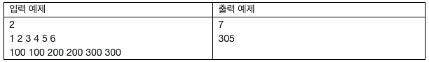

# 22795. 일곱 부하의 평균
## 문제
> 평강 공주는 일곱 명의 부하를 거느리고 있는데, 어느 날 이들 중 한 명이 사라졌다는 보고를 받았다.
>
>마침 부하들에게 관복을 새로 맞춰 주려고 했던 공주는, 의복 제작 일정을 맞추기 위해 일단 사라진 부하의 키를 알아내고자 한다.
>
> 공주는 아래와 같은 사실들을 알고 있다.
>
>사라진 부하는 남아 있는 여섯 부하보다 키가 더 크다. (같거나 작지 않다.)
>
>모든 부하의 키는 cm 단위로 양의 정수이다.
>
>모든 부하의 키의 평균 역시 cm 단위로 양의 정수이다.
>
>남아 있는 여섯 부하의 키가 cm 단위로 주어질 때, 사라진 부하의 키를 계산하는 프로그램을 작성하라.
>
>다만 가능한 키 값이 여럿 있을 수 있으므로, 가능한 것 중 가장 작은 값을 출력한다.

## 입력
첫 번째 줄에 테스트 케이스의 수 T가 주어진다.

각 테스트 케이스는 한 개의 줄로 이루어지며, 각 줄에는 남아 있는 여섯 부하의 키가 cm 단위로 공백 하나씩을 사이로 두고 주어진다.

키를 나타내는 정수는 1 이상 1000 이하이다.
## 출력
각 테스트 케이스마다, 사라진 부하의 키로 가능한 값들 중 최솟값을 출력한다.



## 예제입력 1
```
2
1 2 3 4 5 6
100 100 200 200 300 300
```
## 예제 출력 1
```
7
305
```