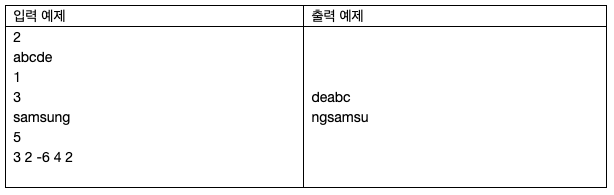

# 22979. 문자열 옮기기
## 문제
> 문자열 S에 다음과 같은 연산을 몇 번 적용할 것이다.
>
>각각의 연산은 정수 X로 표현되며, X에 따라 문자열 S가 아래와 같이 변한다.
>
> - X > 0이면, S의 첫 번째 글자를 떼네어 마지막 글자 뒤에 붙이는 작업을 정확히 X회 반복한다.
>
> - X < 0이면, S의 마지막 글자를 떼네어 첫 번째 글자 앞에 붙이는 작업을 정확히 -X회 반복한다.
>
> - X = 0이면, 아무 일도 일어나지 않는다.
>
> 모든 연산이 종료된 후 문자열 S를 출력하는 프로그램을 작성하라.
## 입력
첫 번째 줄에 테스트 케이스의 수 T가 주어진다.

각 테스트 케이스는 세 개의 줄로 이루어진다. 첫 번째 줄에는 문자열 S가 주어진다. S는 알파벳 소문자로만 구성되며, 길이가 1 이상 1,000 이하이다.

두 번째 줄에는 연산의 횟수 K가 주어진다. K는 1 이상 100 이하의 정수이다.

세 번째 줄에는 K개의 정수가 공백 하나씩을 사이로 두고 주어지며, 각각의 정수는 순서대로 문자열에 적용하는 연산을 나타낸다.

세 번째 줄에 주어지는 정수는 $-10^9$ 이상 $10^9$ 이하이다.


## 출력
각 테스트 케이스마다, 주어진 연산을 모두 순서대로 적용한 뒤의 문자열 S를 출력한다.




## 예제입력 1
```
2
abcde
1
3
samsung
5
3 2 -6 4 2
```
## 예제 출력 1
```
deabc
ngsamsu
```