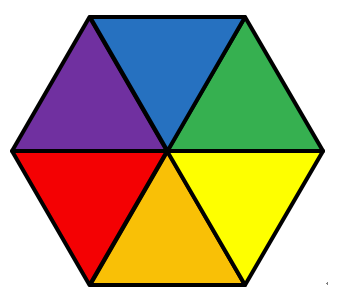

# 23003. 색상환
## 문제
> 아래와 같은 육각 색상환을 생각해 보자.
>
>먼저 빨강, 노랑, 파랑을 배치하고, 사이사이에는 두 색상의 물감을 섞어서 만들 수 있는 색을 넣은 것이다.
>
>아래 그림에서 좌측 하단부터 시작해서 반시계방향으로 빨강색(red), 오렌지색(orange), 노란색(yellow), 초록색(green), 파랑색(blue), 보라색(purple)이 들어 있다.
> 
> 
> 
> 위의 색상환에 있는 색 두 개가 주어질 때, 두 색이
>
>서로 같은 색인지
>
>색상환에서 인접한 (한 변을 공유하고 있는) 색인지
> 
>상환에서 서로 반대에 있는 (마주보고 있는) 색인지
>를 판별하는 프로그램을 작성하라.
## 입력
첫 번째 줄에 테스트 케이스의 수 T가 주어진다.

각 테스트 케이스는 한 개의 줄로 이루어진다.

각 줄에는 두 개의 색을 나타내는 두 문자열 S와 T가 공백 하나를 사이로 두고 주어진다. S와 T는 각각 red, orange, yellow, green, blue, purple 중 하나이다.
## 출력
각 테스트 케이스마다, 하나의 줄에 주어진 두 색이

서로 같은 색이라면 ‘E’

색상환에서 인접한 (한 변을 공유하고 있는) 색이라면 ‘A’

색상환에서 서로 반대에 있는 (마주보고 있는) 색이라면 ‘C’

셋 다 아니라면 ‘X’
를 따옴표를 제외하고 출력한다.


## 예제입력 1
```
4
red red
red purple
red green
red yellow
```
## 예제 출력 1
```
E
A
C
X
```