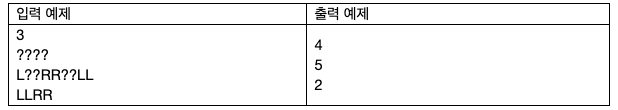

# 24001. 로봇 언어
## 문제
> 수직선 위에 로봇이 하나 놓여있다. 현재 로봇의 좌표는 0이다.
> 
> 로봇은 아래 두 종류의 명령어만 이해할 수 있다.
> 
> - L : 왼쪽으로 한칸 이동한다. 로봇의 좌표가 1 감소하게 된다.
> - R : 오른쪽으로 한칸 이동한다. 로봇의 좌표가 1 증가하게 된다.
> 
>로봇에게 입력할 명령어를 나타내는 문자열 S가 주어진다.
> 
> 다만, 문자열 중 일부는 물음표('?')로 채워져 있는데, 이 부분은 당신이 L 또는 R로 대체해야 한다.
> 
> 물음표를 모두 대체한 이후, 당신은 로봇에 명령어를 순서대로 입력하면서, 로봇이 원점으로부터 얼마나 멀리 떨어졌는지를 기록할 것이다.
> 
> 당신은 물음표를 적절히 대체하여 로봇과 원점 사이의 최대 거리를 최대화하고자 한다.\
> 
## 입력

첫 번째 줄에 테스트 케이스의 수 T가 주어진다.



각 테스트 케이스는 한 개의 줄로 이루어진다.

각 줄에는 길이가 1 이상 50 이하인, L,R,?로만 구성된 문자열 S가 주어진다.
## 출력
각 테스트 케이스마다, 문자열 S의 물음표를 L 또는 R로 적절히 대체하여 로봇과 원점 사이의 최대 거리를 최대화했을 때, 이 최대 거리를 한 줄에 하나씩 출력한다.


예제 1: “LLLL” 또는 “RRRR”

예제 2: “LRRRRRRLL”로 대체하면, 로봇의 좌표는 [-1, 0, 1, 2, 3, 4, 5, 4, 3]이고, 각각 원점으로부터의 거리는 [1, 0, 1, 2, 3, 4, 5, 4, 3]이므로, 원점에서부터의 최대 거리는 5이다.

## 예제입력 1
```

3
????
L??RR??LL
LLRR
```
## 예제 출력 1
```
4
5
2
```