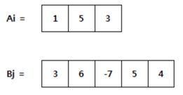

# 1959. 두 개의 숫자열
## 문제
> N 개의 숫자로 구성된 숫자열 Ai (i=1~N) 와 M 개의 숫자로 구성된 숫자열 Bj (j=1~M) 가 있다.
>
>아래는 N =3 인 Ai 와 M = 5 인 Bj 의 예이다.
> 
> 
> 
> Ai 나 Bj 를 자유롭게 움직여서 숫자들이 서로 마주보는 위치를 변경할 수 있다.
> 
> 단, 더 긴 쪽의 양끝을 벗어나서는 안 된다.
> 
> 
> 
>서로 마주보는 숫자들을 곱한 뒤 모두 더할 때 최댓값을 구하라.
>
> 위 예제의 정답은 아래와 같이 30 이 된다.
> 
> 
## 입력
가장 첫 줄에는 테스트 케이스의 개수 T가 주어지고, 그 아래로 각 테스트 케이스가 주어진다.

각 테스트 케이스의 첫 번째 줄에 N 과 M 이 주어지고,

두 번째 줄에는 Ai,

세 번째 줄에는 Bj 가 주어진다.
## 출력
출력의 각 줄은 '#t'로 시작하고, 공백을 한 칸 둔 다음 정답을 출력한다.

(t는 테스트 케이스의 번호를 의미하며 1부터 시작한다.)

## 제한
N 과 M은 3 이상 20 이하이다.
## 예제입력 1
```
10
3 5
1 5 3
3 6 -7 5 4
7 6
6 0 5 5 -1 1 6
-4 1 8 7 -9 3
5 15
-8 4 6 -9 -1
-1 1 0 -2 10 10 0 2 5 2 10 7 -9 7 -8
11 20
3 -8 4 0 -1 -4 8 3 7 -3 1
3 10 0 1 10 0 -8 -6 9 -7 -1 1 -1 4 10 6 0 -8 -5 0
11 16
-6 0 -1 7 5 -1 -3 0 -9 8 4
0 -6 1 1 8 -8 0 -7 4 -7 -8 -2 1 4 0 -10
3 16
8 9 0
-4 9 -7 -1 -8 3 1 -6 -8 5 2 -7 -9 -10 8 9
11 3
3 -4 -7 7 -2 5 5 0 -2 -8 4
-1 1 3
14 6
-9 9 0 -7 8 10 7 -3 2 3 0 0 0 -2
8 1 -9 3 0 -7
17 10
-6 -1 -4 2 -5 1 -10 -9 8 -9 -6 1 10 0 -5 -8 1
7 6 2 7 -8 4 8 10 -2 9
11 9
8 6 -2 0 0 5 10 2 -10 -8 -10
10 -9 -7 -1 0 8 0 10 3
```
## 예제 출력 1
```
#1 30
#2 63
#3 140
#4 181
#5 63
#6 58
#7 22
#8 120
#9 96
#10 70
```